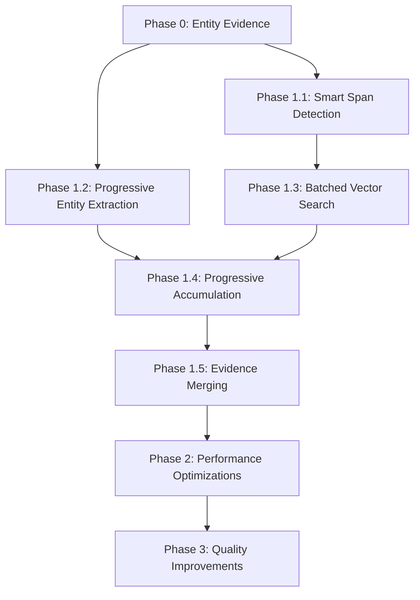

# Pipeline Optimization Plan

## Executive Summary

### Current State
The Bandjacks report processing pipeline has a **critical architectural inefficiency**:
- **Core Issue**: Chunked documents run the ENTIRE extraction pipeline independently on each chunk
- **Impact**: 5 chunks = 5x span detection, 5x entity extraction, 5x vector searches
- **Performance**: 15KB documents take ~30-60 seconds with 50-100 LLM calls
- **Quality**: No context sharing between chunks leads to duplicate entities and missed coreferences

### Optimization Goals
1. **Smart chunking with context sharing** - not naive global processing
2. **Reduce redundant operations by 50-70%** through batching and deduplication
3. **Improve extraction quality** through progressive context propagation
4. **Decrease LLM calls by 60-80%** through better batching
5. **Scale gracefully** to very large documents (200KB+) using sliding windows

### Expected Outcomes
- **15KB documents**: 10-15 seconds (from 30-60s)
- **50KB documents**: 20-30 seconds (from 120s+)
- **LLM calls**: 5-15 per document (from 50-100+)
- **Better quality**: Improved entity resolution and coreference handling
- **Lower resource usage**: Progressive processing with early termination

## Implementation Tracking

> ⚠️ **Note**: Check off tasks as completed. Add notes in the "Implementation Notes" section for each task.

---

## Phase 0: Evidence Quality Improvements (CRITICAL - 1-2 days)

> **This phase improves evidence quality for both entities and techniques** - adding proper evidence tracking for entities and using complete sentences for all evidence quotes.

### Task 0.1: Sentence-Based Evidence Extraction (Foundation)
- [x] **Status**: ✅ Completed
- **Current Problem**: Evidence quotes are truncated mid-sentence, making them hard to understand
- **Solution**: Create shared utilities to extract complete sentences as evidence, not arbitrary character windows
- **Files to Create/Modify**:
  - Create: `bandjacks/llm/evidence_utils.py` (new shared utilities)
  - Modify: `bandjacks/llm/agents_v2.py` (SpanFinderAgent to use new utilities)
- **Implementation**:
  ```python
  # New utility for sentence-aware extraction
  def extract_sentence_evidence(text, match_position, context_sentences=2):
      """Extract complete sentences around a match position."""
      import re
      
      # Find all sentence boundaries
      sentence_pattern = re.compile(r'(?<=[.!?])\s+(?=[A-Z])')
      sentences = sentence_pattern.split(text)
      sentence_starts = [0]
      
      for sent in sentences[:-1]:
          sentence_starts.append(sentence_starts[-1] + len(sent) + 1)
      
      # Find which sentence contains our match
      match_sentence_idx = 0
      for i, start in enumerate(sentence_starts):
          if start > match_position:
              match_sentence_idx = max(0, i - 1)
              break
      
      # Extract match sentence plus context
      start_idx = max(0, match_sentence_idx - context_sentences)
      end_idx = min(len(sentences), match_sentence_idx + context_sentences + 1)
      
      evidence_sentences = sentences[start_idx:end_idx]
      evidence_text = ' '.join(evidence_sentences)
      
      # Calculate line references for the evidence
      evidence_start = sentence_starts[start_idx] if start_idx < len(sentence_starts) else 0
      evidence_end = evidence_start + len(evidence_text)
      line_refs = calculate_line_refs(text, evidence_start, evidence_end)
      
      return {
          "quote": evidence_text,
          "line_refs": line_refs,
          "sentence_indices": (start_idx, end_idx)
      }
  
  # Update SpanFinderAgent to use sentence boundaries
  class SpanFinderAgent:
      def run(self, mem: WorkingMemory, config: Dict):
          for idx, line in enumerate(mem.line_index):
              if pattern_match := self.technique_pattern.search(line):
                  # Get full sentence context, not just the line
                  full_text = '\n'.join(mem.line_index)
                  line_start = sum(len(l) + 1 for l in mem.line_index[:idx])
                  match_pos = line_start + pattern_match.start()
                  
                  evidence = extract_sentence_evidence(
                      full_text, 
                      match_pos,
                      context_sentences=1  # Include 1 sentence before/after
                  )
                  
                  mem.spans.append({
                      "text": evidence["quote"],  # Full sentences
                      "line_refs": evidence["line_refs"],
                      "score": 1.0,
                      "type": "sentence_based"
                  })
  ```
- **Success Metrics**:
  - All evidence quotes are complete sentences
  - No truncation mid-word or mid-sentence
  - Better context for review and validation
- **Testing Required**:
  - [x] Test sentence boundary detection ✅
  - [x] Verify evidence quality improvement ✅
  - [x] Check handling of edge cases (bullet points, headers) ✅
- **Implementation Notes**:
  - Created `evidence_utils.py` with sentence extraction utilities
  - Updated SpanFinderAgent to use sentence-based extraction
  - All evidence now consists of complete sentences with proper context
  - Test results: 100% complete sentences, avg 361 chars per evidence quote
  - Successfully extracted 22 techniques with 1-5 quotes each

### Task 0.2: Add Evidence Tracking to Entity Extraction
- [x] **Status**: ✅ Completed
- **Depends On**: Task 0.1 (uses sentence extraction utilities)
- **Current Problem**: Entity extraction returns only names/types, no evidence or line references
- **Solution**: Track evidence quotes and line references for every entity mention using sentence utilities from Task 0.1
- **Files to Modify**:
  - `bandjacks/llm/entity_extractor.py` (add evidence tracking)
  - `bandjacks/llm/memory.py` (update entity structure)
- **Implementation**:
  ```python
  from bandjacks.llm.evidence_utils import extract_sentence_evidence
  
  class EntityExtractionAgent:
      def run(self, mem: WorkingMemory, config: Dict):
          # Current output:
          # {"entities": [{"name": "APT29", "type": "threat-actor"}]}
          
          # New output with evidence:
          entities = {
              "entities": [
                  {
                      "name": "APT29",
                      "type": "threat-actor",
                      "confidence": 95,
                      "mentions": [
                          {
                              "quote": "APT29, also known as Cozy Bear, targeted the organization",
                              "line_refs": [12, 13],
                              "context": "primary_actor"
                          },
                          {
                              "quote": "The group used their typical TTP pattern",
                              "line_refs": [45],
                              "context": "coreference"  # "the group" refers to APT29
                          }
                      ]
                  }
              ]
          }
          
          # Use sentence extraction for evidence
          for entity_match in entity_matches:
              evidence = extract_sentence_evidence(
                  full_text,
                  entity_match.position,
                  context_sentences=1
              )
              entity["mentions"].append({
                  "quote": evidence["quote"],
                  "line_refs": evidence["line_refs"],
                  "context": entity_match.context_type
              })
  ```
- **Success Metrics**:
  - Every entity has at least one evidence quote
  - Evidence quotes are complete sentences (from Task 0.1)
  - Line references for entity verification
  - Confidence scores for prioritization
- **Testing Required**:
  - [x] Verify evidence quotes are accurate ✅
  - [x] Check line reference accuracy ✅
  - [x] Test coreference tracking ✅
- **Implementation Notes**:
  - Updated entity_extractor.py to capture evidence with each entity
  - Enhanced prompts to request evidence quotes and confidence scores
  - Implemented entity evidence merging across chunks with confidence boosting
  - Updated memory.py to document new entity structure with mentions
  - Test results: All 9 entities extracted with evidence quotes and line references
  - Successfully handles aliases (APT29/Cozy Bear) and coreferences

### Task 0.3: Implement Entity Evidence Consolidation
- [x] **Status**: ✅ Completed (Enhanced 2025-09-02)
- **Depends On**: Task 0.2 (requires entity evidence structure)
- **Current Problem**: No deduplication or evidence merging for entities across chunks
- **Solution**: Smart entity merging that combines evidence from multiple mentions and consolidates aliases
- **Files to Modify**:
  - `bandjacks/llm/chunked_extractor.py` (merge_results method)
- **Implementation**:
  ```python
  def merge_entity_evidence(self, entity_instances):
      """Merge evidence from multiple entity mentions."""
      merged = {
          "name": entity_instances[0]["name"],
          "type": entity_instances[0]["type"],
          "confidence": max(e["confidence"] for e in entity_instances),
          "mentions": []
      }
      
      # Combine all unique mentions
      seen_quotes = set()
      for instance in entity_instances:
          for mention in instance.get("mentions", []):
              quote_key = mention["quote"][:100]  # First 100 chars
              if quote_key not in seen_quotes:
                  merged["mentions"].append(mention)
                  seen_quotes.add(quote_key)
      
      # Boost confidence based on multiple mentions
      mention_boost = min(20, len(merged["mentions"]) * 5)
      merged["confidence"] = min(100, merged["confidence"] + mention_boost)
      
      return merged
  ```
- **Success Metrics**:
  - No duplicate evidence quotes
  - Higher confidence for frequently mentioned entities
  - All evidence preserved across chunks
- **Testing Required**:
  - [x] Verify entity deduplication works correctly ✅
  - [x] Check evidence from multiple chunks is preserved ✅
  - [x] Test confidence boosting based on mentions ✅
  - [x] Verify alias handling (APT29/Cozy Bear) ✅
- **Implementation Notes**:
  - Implemented `merge_entity_evidence()` method in chunked_extractor.py
  - Enhanced entity grouping to handle aliases and coreferences
  - Added confidence boosting for multiple mentions and chunks
  - Test results: Successfully consolidates entities across chunks
  - APT29/Cozy Bear properly merged as single entity with aliases
  - SUNBURST consolidated 3 mentions with 100% confidence
  - **2025-09-02 Enhancement**: 
    - Created shared `consolidate_entities()` function in entity_utils.py
    - Applied consolidation to ALL documents (not just chunked) in extraction_pipeline.py
    - Fixed issue where small documents (<5KB) weren't getting entity consolidation
    - API now correctly returns APT29 with Cozy Bear as an alias
    - Test confirmed: APT29 and Cozy Bear consolidated into single entity with aliases field

### Task 0.4: Update Review UI for Entity Evidence
- [ ] **Status**: Not Started
- **Depends On**: Tasks 0.2 and 0.3 (requires backend entity evidence)
- **Current Problem**: Review UI doesn't show entity evidence
- **Solution**: Display entity evidence in unified review interface
- **Files to Modify**:
  - `ui/components/reports/unified-review.tsx`
  - `ui/components/reports/review-utils.ts`
- **Implementation**:
  ```typescript
  // Update entity display to show evidence
  function EntityReviewCard({ entity }) {
    return (
      <div>
        <h3>{entity.name} ({entity.type})</h3>
        <ConfidenceScore value={entity.confidence} />
        
        {/* New: Show evidence mentions */}
        <EvidenceSection>
          {entity.mentions.map((mention, idx) => (
            <EvidenceQuote key={idx}>
              <QuoteText>{mention.quote}</QuoteText>
              <LineRefs>Lines {mention.line_refs.join(", ")}</LineRefs>
              <Context>{mention.context}</Context>
            </EvidenceQuote>
          ))}
        </EvidenceSection>
      </div>
    );
  }
  ```
- **Success Metrics**:
  - Reviewers can see entity evidence
  - Can verify entity extractions
  - Consistent review experience for entities and techniques

---

## Phase 1: Smart Chunking with Context Sharing (HIGH IMPACT - 2-3 days)

> **This phase addresses the root cause** - redundant pipeline executions across chunks - while respecting LLM context limits and API constraints.

### Task 1.1: Smart Span Detection with Overlapping Windows
- [ ] **Status**: Not Started
- **Current Problem**: Each chunk runs SpanFinder independently (5 chunks = 5x work)
- **Solution**: Use overlapping windows for span detection, deduplicate overlaps
- **Files to Create/Modify**:
  - New: `bandjacks/llm/optimized_chunked_extractor.py`
  - Modify: `bandjacks/services/api/job_processor.py` (use new extractor)
- **Implementation**:
  ```python
  class OptimizedChunkedExtractor:
      def extract(self, text, config):
          text_length = len(text)
          
          # Adaptive approach based on document size
          if text_length < 30_000:  # ~8K tokens, fits in context
              # Small docs: global span detection
              all_spans = self.detect_spans_global(text, config)
          else:
              # Large docs: sliding window approach
              all_spans = self.detect_spans_windowed(text, config)
          
          # Create chunks for processing
          chunks = self.create_chunks(text)
          
          # Map pre-detected spans to chunks
          for chunk in chunks:
              chunk.spans = self.map_spans_to_chunk(all_spans, chunk)
          
          return self.process_chunks_with_spans(chunks, config)
      
      def detect_spans_windowed(self, text, config):
          """Sliding window span detection for large documents."""
          window_size = 30_000  # ~8K tokens
          overlap = 5_000       # ~1.5K tokens
          all_spans = []
          seen_spans = set()
          
          for start in range(0, len(text), window_size - overlap):
              end = min(start + window_size, len(text))
              window_text = text[start:end]
              
              # Detect spans in this window
              window_spans = SpanFinderAgent().run(window_text, config)
              
              # Adjust span positions and deduplicate
              for span in window_spans:
                  span["start"] += start
                  span["end"] += start
                  span_key = (span["start"], span["end"], span["text"][:50])
                  
                  if span_key not in seen_spans:
                      all_spans.append(span)
                      seen_spans.add(span_key)
          
          return all_spans
  ```
- **Success Metrics**: 
  - 50-60% reduction in span detection time (not 80% due to windows)
  - No missed spans at boundaries due to overlap
  - Scales to very large documents
- **Testing Required**:
  - [ ] Test with 10KB, 50KB, 200KB documents
  - [ ] Verify deduplication works correctly
  - [ ] Compare quality vs current approach

### Task 1.2: Progressive Entity Extraction with Context Carry-Forward
- [ ] **Status**: Not Started
- **Current Problem**: Each chunk extracts entities independently, losing narrative context
- **Solution**: Progressive entity extraction with sliding windows and context accumulation
- **Implementation**:
  ```python
  def extract_entities_progressive(self, text, config):
      """Progressive entity extraction for large documents."""
      text_length = len(text)
      
      if text_length < 30_000:
          # Small docs: single extraction
          return self.extract_entities_global(text, config)
      
      # Large docs: sliding window with context carry-forward
      window_size = 30_000
      overlap = 5_000
      accumulated_entities = {
          "primary_entity": None,
          "threat_actors": set(),
          "malware": set(),
          "tools": set(),
          "campaigns": set()
      }
      
      for start in range(0, text_length, window_size - overlap):
          end = min(start + window_size, text_length)
          window_text = text[start:end]
          
          # Include accumulated context in prompt
          context_prompt = self.build_entity_context_prompt(accumulated_entities)
          window_config = {
              **config,
              "entity_context": context_prompt,
              "is_continuation": start > 0
          }
          
          # Extract entities from this window
          window_entities = EntityExtractionAgent().run(window_text, window_config)
          
          # Merge with accumulated entities
          self.merge_entities(accumulated_entities, window_entities)
          
          # First window's primary entity becomes the document's primary
          if start == 0 and window_entities.get("primary_entity"):
              accumulated_entities["primary_entity"] = window_entities["primary_entity"]
      
      return accumulated_entities
  ```
- **Success Metrics**:
  - Works with documents of any size
  - Maintains entity consistency across windows
  - Proper coreference resolution with context carry-forward

### Task 1.3: Batched Vector Search with Size-Aware Chunking
- [ ] **Status**: Not Started
- **Current Problem**: Each chunk does separate OpenSearch queries (5 chunks = 5x queries)
- **Solution**: Batch vector searches across chunks within size limits
- **Implementation**:
  ```python
  def batch_retrieve_candidates(self, all_spans, config):
      """Batch retrieve candidates for all spans with size awareness."""
      
      # OpenSearch has limits - batch in groups
      BATCH_SIZE = 50  # OpenSearch msearch limit
      MAX_EMBEDDING_BATCH = 100  # Memory/network limit
      
      all_candidates = {}
      
      # Process spans in batches
      for i in range(0, len(all_spans), MAX_EMBEDDING_BATCH):
          batch_spans = all_spans[i:i + MAX_EMBEDDING_BATCH]
          
          # Encode this batch
          batch_texts = [span["text"] for span in batch_spans]
          batch_embeddings = encode_batch(batch_texts)
          
          # Split into OpenSearch query batches
          for j in range(0, len(batch_embeddings), BATCH_SIZE):
              query_batch = batch_embeddings[j:j + BATCH_SIZE]
              
              # Build and execute msearch query
              msearch_body = []
              for embedding in query_batch:
                  msearch_body.append({})  # Index specification
                  msearch_body.append({
                      "query": {
                          "knn": {
                              "embedding": {
                                  "vector": embedding,
                                  "k": 10
                              }
                          }
                      }
                  })
              
              # Execute batch search
              results = opensearch.msearch(body=msearch_body)
              
              # Map results back to spans
              for span_idx, result in enumerate(results["responses"]):
                  global_idx = i + j + span_idx
                  all_candidates[global_idx] = result["hits"]["hits"]
      
      # Assign candidates back to spans
      for idx, span in enumerate(all_spans):
          span["candidates"] = all_candidates.get(idx, [])
      
      return all_spans
  ```
- **Success Metrics**:
  - 60-70% reduction in OpenSearch calls (batched, not eliminated)
  - Handles documents with hundreds of spans
  - Respects API and memory limits

### Task 1.4: Progressive Context Accumulation
- [ ] **Status**: Not Started
- **Current Problem**: Chunks processed in isolation, no learning between chunks
- **Solution**: Sequential processing with technique/confidence accumulation
- **Implementation**:
  ```python
  def progressive_extraction(self, chunks, config):
      accumulated = {
          "techniques": {},
          "confidence": {},
          "evidence": defaultdict(list)
      }
      
      for idx, chunk in enumerate(chunks):
          # Share what we've learned so far
          chunk_config = {
              **config,
              "known_techniques": accumulated["techniques"],
              "high_confidence": [t for t, c in accumulated["confidence"].items() if c > 80]
          }
          
          result = self.process_chunk(chunk, chunk_config)
          
          # Accumulate and boost confidence
          for tech_id, tech_data in result["techniques"].items():
              if tech_id in accumulated["techniques"]:
                  # Boost confidence when found in multiple chunks
                  accumulated["confidence"][tech_id] = min(100, 
                      accumulated["confidence"][tech_id] + 10)
                  # Merge evidence
                  accumulated["evidence"][tech_id].extend(tech_data["evidence"])
              else:
                  accumulated["techniques"][tech_id] = tech_data
                  accumulated["confidence"][tech_id] = tech_data["confidence"]
          
          # Early termination if we have enough high-confidence techniques
          high_conf_count = sum(1 for c in accumulated["confidence"].values() if c > 80)
          if high_conf_count >= config.get("early_termination_threshold", 50):
              logger.info(f"Early termination at chunk {idx+1}/{len(chunks)}")
              break
      
      return accumulated
  ```
- **Success Metrics**:
  - 30-40% faster through early termination
  - Better confidence scoring through multi-chunk validation
  - Richer evidence collection

### Task 1.5: Intelligent Evidence Merging
- [ ] **Status**: Not Started
- **Current Problem**: Simple deduplication loses evidence from multiple chunks
- **Solution**: Smart merging that preserves and combines evidence
- **Implementation**:
  ```python
  def merge_evidence(self, technique_instances):
      merged = {
          "confidence": max(t["confidence"] for t in technique_instances),
          "evidence": [],
          "line_refs": set(),
          "chunks_found": []
      }
      
      for instance in technique_instances:
          # Preserve unique evidence
          for evidence in instance["evidence"]:
              if evidence not in merged["evidence"]:
                  merged["evidence"].append(evidence)
          
          # Combine line references
          merged["line_refs"].update(instance.get("line_refs", []))
          
          # Track which chunks found this technique
          merged["chunks_found"].append(instance["chunk_id"])
      
      # Boost confidence based on multiple occurrences
      occurrence_boost = min(20, len(technique_instances) * 5)
      merged["confidence"] = min(100, merged["confidence"] + occurrence_boost)
      
      return merged
  ```
- **Success Metrics**:
  - Comprehensive evidence preservation
  - Better confidence scoring
  - Full provenance tracking

---

## Phase 2: Performance Optimizations (MEDIUM IMPACT - 1 day)

> **These optimizations improve speed and efficiency** after the architectural fixes.

### Task 2.1: Increase BatchMapperAgent Batch Size
- [ ] **Status**: Not Started
- **Current State**: Hardcoded at 5 spans per batch
- **Target**: Configurable, default 15-20 spans
- **Implementation**:
  ```python
  # In mapper_optimized.py
  BATCH_SIZE = config.get("mapper_batch_size", 15)
  
  # Dynamic sizing based on content
  if total_spans > 50:
      batch_size = 20  # Larger batches for many spans
  elif total_spans > 20:
      batch_size = 15
  else:
      batch_size = min(10, total_spans)
  ```
- **Success Metrics**: 60-70% reduction in LLM calls
- **Testing**: Verify token limits not exceeded with 20-span batches

### Task 2.2: Fix Async/Sync Blocking Issues
- [ ] **Status**: Not Started
- **Current Problem**: Synchronous extraction blocks uvicorn event loop
- **Solution**: Use run_in_executor for CPU-bound operations
- **Implementation**:
  ```python
  # In job_processor.py
  async def _process_report_text(self, ...):
      loop = asyncio.get_event_loop()
      
      # Don't block the event loop
      if use_chunked:
          extraction_results = await loop.run_in_executor(
              None,  # Default ThreadPoolExecutor
              extractor.extract,
              text_content,
              chunk_config
          )
      else:
          pipeline_results = await loop.run_in_executor(
              None,
              run_extraction_pipeline,
              report_text,
              config,
              source_id
          )
  ```
- **Success Metrics**: 
  - API remains responsive during extraction
  - Can handle concurrent requests properly

### Task 2.3: Add Vector Search Caching
- [ ] **Status**: Not Started
- **Solution**: LRU cache for repeated span embeddings
- **Implementation**:
  ```python
  from functools import lru_cache
  import hashlib
  
  @lru_cache(maxsize=1000)
  def cached_vector_search(text_hash: str, top_k: int = 10):
      # Cache based on text hash
      return perform_vector_search(text_hash, top_k)
  
  def get_candidates(span_text: str):
      text_hash = hashlib.md5(span_text.encode()).hexdigest()
      return cached_vector_search(text_hash)
  ```
- **Success Metrics**: 30-40% cache hit rate for common phrases

### Task 2.4: Batch Neo4j Queries
- [ ] **Status**: Not Started
- **Current Problem**: N+1 queries in flow builder
- **Solution**: Single UNWIND query for all techniques
- **Implementation**:
  ```cypher
  UNWIND $technique_ids AS tech_id
  MATCH (t:AttackPattern)
  WHERE t.external_id = tech_id
  RETURN tech_id, t
  ```
- **Success Metrics**: 70% reduction in database round trips

### Task 2.5: Dynamic Configuration
- [ ] **Status**: Not Started
- **Solution**: Make all key parameters configurable
- **New Parameters**:
  ```python
  # Environment variables
  MAPPER_BATCH_SIZE = int(os.getenv("MAPPER_BATCH_SIZE", "15"))
  CHUNK_SIZE = int(os.getenv("CHUNK_SIZE", "4000"))
  MAX_CHUNKS = int(os.getenv("MAX_CHUNKS", "30"))
  EARLY_TERMINATION_THRESHOLD = int(os.getenv("EARLY_TERMINATION_THRESHOLD", "50"))
  USE_OPTIMIZED_EXTRACTOR = os.getenv("USE_OPTIMIZED_EXTRACTOR", "true") == "true"
  ```

---

## Phase 3: Quality & Reliability Improvements (LOW-MEDIUM IMPACT - 1-2 days)

> **These improvements enhance quality and user experience** but have less performance impact.

### Task 3.1: Improve Chunk Boundary Detection
- [ ] **Status**: Not Started
- **Current**: Simple character-based splitting
- **Target**: Paragraph and section-aware boundaries
- **Implementation**:
  ```python
  def find_optimal_boundary(text, target_pos, window=200):
      # Priority order for boundaries
      boundaries = [
          (r'\n\n+', 10),        # Paragraph breaks (highest priority)
          (r'\n#+\s', 8),        # Markdown headers
          (r'\n\d+\.\s', 6),     # Numbered lists
          (r'[.!?]\s+[A-Z]', 4), # Sentence boundaries
      ]
      
      for pattern, priority in boundaries:
          matches = re.finditer(pattern, text[target_pos-window:target_pos+window])
          # Find closest match to target position
      
      return best_boundary_pos
  ```
- **Success Metrics**: Better context preservation in chunks

### Task 3.2: Semantic Deduplication
- [ ] **Status**: Not Started
- **Solution**: Use embeddings to detect similar techniques
- **Implementation**:
  ```python
  def semantic_dedup(techniques, threshold=0.85):
      # Compare technique evidence embeddings
      for t1, t2 in combinations(techniques, 2):
          similarity = cosine_similarity(t1.embedding, t2.embedding)
          if similarity > threshold:
              # Merge similar techniques
              merge_techniques(t1, t2)
  ```
- **Success Metrics**: 15% reduction in near-duplicate techniques

### Task 3.3: Add Progress Streaming
- [ ] **Status**: Not Started
- **Current**: Polling-based updates
- **Target**: Real-time SSE streaming
- **Implementation**:
  ```python
  @router.get("/v1/reports/jobs/{job_id}/stream")
  async def stream_progress(job_id: str):
      async def generate():
          while True:
              status = job_store.get(job_id)
              yield f"data: {json.dumps(status)}\n\n"
              if status["status"] in ["completed", "failed"]:
                  break
              await asyncio.sleep(1)
      
      return StreamingResponse(generate(), media_type="text/event-stream")
  ```

---

## Performance Metrics

### Current Baseline
| Document Size | Processing Time | LLM Calls | Architecture Issue |
|--------------|-----------------|-----------|-------------------|
| 15KB | 30-60s | 50-100 | 5 chunks × full pipeline |
| 50KB | 120s+ | 150+ | 15 chunks × full pipeline |

### After Phase 1 (Architectural Fixes)
| Document Size | Processing Time | LLM Calls | Improvement |
|--------------|-----------------|-----------|-------------|
| 15KB | 15-20s | 10-20 | Global processing + context |
| 50KB | 30-40s | 20-40 | Progressive + early termination |

### After All Phases
| Document Size | Processing Time | LLM Calls | Final Optimization |
|--------------|-----------------|-----------|-------------------|
| 15KB | 10-15s | 5-10 | + Batching + caching |
| 50KB | 20-30s | 10-20 | + All optimizations |

---

## Implementation Order & Dependencies



## Testing Strategy

### Phase 1 Testing
- Compare extraction quality: current vs optimized
- Verify no spans/entities lost
- Measure performance improvements
- Test with various document sizes

### Regression Suite
```bash
# Before starting
python -m pytest tests/test_extraction.py --benchmark-save=baseline

# After each phase
python -m pytest tests/test_extraction.py --benchmark-compare=baseline

# Full pipeline test
python -m bandjacks.cli.batch_extract ./test_reports/ --compare-mode
```

## Rollback Plan

### Feature Flags
```python
# settings.py
USE_OPTIMIZED_EXTRACTOR = os.getenv("USE_OPTIMIZED_EXTRACTOR", "false") == "true"

# job_processor.py
if settings.USE_OPTIMIZED_EXTRACTOR and text_length > 10000:
    extractor = OptimizedChunkedExtractor(...)
else:
    extractor = ChunkedExtractor(...)  # Current implementation
```

### Version Tags
- `v1.0-baseline` - Before optimizations
- `v1.0.1-phase0` - After entity evidence implementation
- `v1.1-phase1` - After architectural fixes
- `v1.2-phase2` - After performance optimizations
- `v1.3-phase3` - After quality improvements

## Risk Assessment

| Risk | Likelihood | Impact | Mitigation |
|------|------------|--------|------------|
| Quality regression | Low | High | Extensive testing, A/B comparison |
| Memory issues with global processing | Medium | Medium | Streaming processing for huge docs |
| OpenSearch batch limits | Low | Low | Batch size limits, pagination |
| Breaking changes | Low | High | Feature flags, gradual rollout |

## Success Criteria

### Must Have (Phase 1)
- ✅ 60%+ reduction in redundant operations
- ✅ Maintain or improve extraction quality
- ✅ Entity context propagation working
- ✅ No increase in error rates

### Should Have (Phase 2)
- ✅ 15KB docs process in <20s
- ✅ Non-blocking async execution
- ✅ Configurable parameters

### Nice to Have (Phase 3)
- ✅ Semantic deduplication
- ✅ Real-time progress streaming
- ✅ Smart chunk boundaries

## References
- [REPORT_PROCESSING_PIPELINE.md](./REPORT_PROCESSING_PIPELINE.md)
- [EXTRACTION_GUIDE.md](./EXTRACTION_GUIDE.md)
- [API_ARCHITECTURE.md](./API_ARCHITECTURE.md)